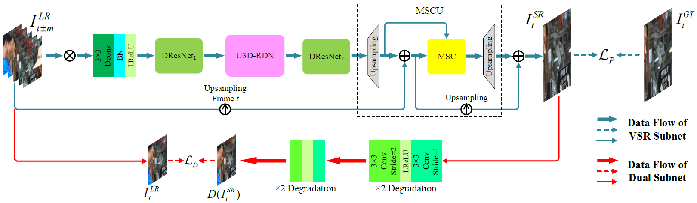

# Large Motion Video Super-Resolution with Dual Subnet and Multi-Stage Communicated Upsampling

This repo is an official PyTorch implementation of our AAAI 2021 paper "Large Motion Video Super-Resolution with Dual Subnet and Multi-Stage Communicated Upsampling" ([DSMC](https://ojs.aaai.org/index.php/AAAI/article/view/16310)). 



## Dependencies

- Ubuntu
- Python >= 3.6.5
- PyTorch >= 1.4.0
- TorchVision >=0.5.0
- Tqdm
- thop
- Deformable Convolution V2. The installation follows the official [README](https://github.com/chengdazhi/Deformable-Convolution-V2-PyTorch). Usually, the following commands are enough:

```
cd lib/dcn/
sh make.sh
```

## Dataset

We added [Vimeo90K](http://toflow.csail.mit.edu/) and [REDS](https://seungjunnah.github.io/Datasets/reds.html) training support for our DSMC. Meanwhile, we use 4 videos in REDS (REDS4) and [Vid4](https://drive.google.com/file/d/1ZuvNNLgR85TV_whJoHM7uVb-XW1y70DW/view?usp=sharing) as test dataset.

## HOWTO

### Vimeo90K Training

To train with Vimeo90K dataset, run with the following command:

```
python train_vimeo.py --epochs your_epoch_num --trainlr lr_trainset_path --trainhr hr_trainset_path --vallr lr_valset_path --valhr hr_valset_path --pretrained_weights pretrained_weights_path
```

It is noted that validation dataset is from Vimeo90K by default. Therefore, the file structure is as follows:

```
val_path_root/00001/0266/im1.png
val_path_root/00001/0266/im2.png
val_path_root/00001/0266/im3.png
val_path_root/00001/0266/im4.png
val_path_root/00001/0266/im5.png
val_path_root/00001/0266/im6.png
...
```

The file structure of training dataset is the same as official Vimeo90K dataset.

### REDS Training

To train with REDS dataset, run with the following command:

```
python train.py --epochs your_epoch_num --trainlr lr_trainset_path --trainhr hr_trainset_path --vallr lr_valset_path --valhr hr_valset_path --pretrained_weights pretrained_weights_path
```

It is noted that validation dataset is from REDS validation dataset by default. Therefore, the file structure is as follows:

```
val_path_root/000/00000000.png
val_path_root/000/00000001.png
val_path_root/000/00000002.png
...
```

The file structure of training dataset is the same as official REDS dataset.

### Inference

We offer pretrained weights on Vimeo90K dataset, which can be downloaded from [here](https://drive.google.com/file/d/1XHHwNziLrBEutNbRps7w8eZLs3tIdIbR/view?usp=sharing). To test on your video, you should follow these steps:

1. Prepare your data as the following structure:

```
test_path_root/000/00000000.png
test_path_root/000/00000001.png
test_path_root/000/00000002.png
...
```

which is the same as the file structure of REDS. It is noted that the directory and image names should be numbered as well.

2. Put your `pkl` format weights in `weights` directory.
3. Open `test.py` and edit `frame_path`, `gt_path`, `weight_path`  and `batch_size` to your custom.
4. Run `python test.py`

## Citations

Please cite our work if you find it useful.

```
@article{DSMC2021,
  title={Large motion video super-resolution with dual subnet and multi-stage communicated upsampling},
  author={Liu, Hongying and Zhao, Peng and Ruan, Zhubo and Shang, Fanhua and Liu, Yuanyuan},
  booktitle={Proceedings of the AAAI Conference on Artificial Intelligence},
  year={2021}
}
```

